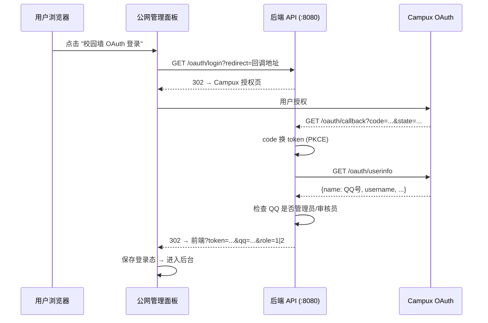

# Memories

基于 Android 的图片分享与管理平台，内嵌 HTTP 服务器，支持局域网/外网访问。

## 架构

```
┌──────────────────────────────────────────────┐
│                  Android 设备                  │
│                                              │
│  ┌─────────────────┐  ┌───────────────────┐  │
│  │ EmbeddedServer  │  │   AdminServer     │  │
│  │   (API :8080)    │  │  (静态文件 :8081)  │  │
│  │   CORS 开放      │  │  仅局域网访问      │  │
│  └───────┬─────────┘  └────────┬──────────┘  │
│          │                     │              │
│  ┌───────┴─────────────────────┴──────────┐  │
│  │           DatabaseHelper               │  │
│  │    (SQLite /sdcard/Memories/memories.db)│  │
│  │    (外部存储，卸载不丢失)                │  │
│  └─────────────────────────────────────────┘  │
│                                              │
│  ┌──────────────────────────────────────────┐ │
│  │  内网管理面板 (React) → assets/admin/    │ │
│  │  公网管理面板 (React) → 独立部署         │ │
│  └──────────────────────────────────────────┘ │
└──────────────────────────────────────────────┘
```

| 组件 | 端口 | 访问范围 | 说明 |
|------|------|---------|------|
| **EmbeddedServer** | 8080 | 公网 | REST API，CORS 全开放 |
| **AdminServer** | 8081 | 仅局域网 | 内网管理面板，自动注入 API 地址 |
| **内网管理面板** | — | 仅局域网 | 运维用，完整系统管理 |
| **公网管理面板** | — | 公网 | 独立部署，OAuth 登录，仅管理员/审核员可访问 |

## 技术栈

- **后端**: Java 8, NanoHTTPD, SQLite (Android)
- **前端**: React 19, TypeScript 6, Vite 8
- **构建**: Gradle 8.1, Android SDK 35
- **最低系统**: Android 10 (API 29)

## 项目结构

```
Memories/
├── app/                          # Android 主应用
│   ├── build.gradle              # 应用构建配置
│   ├── libs/frp_universal.aar    # FRPC 内网穿透 SDK
│   └── src/main/java/com/example/memories/
│       ├── EmbeddedServer.java   # API 服务器 (NanoHTTPD)
│       ├── AdminServer.java      # 管理面板静态文件服务
│       ├── DatabaseHelper.java   # SQLite 数据库操作（外部存储持久化 + 日志统计）
│       ├── WriteQueue.java       # 数据库写入队列（高并发优化）
│       ├── WebDavBackup.java     # WebDAV 自动备份
│       ├── OAuthHelper.java      # OAuth PKCE S256 认证
│       ├── FrpcManager.java      # 内网穿透管理
│       └── ...                   # 其他服务组件
├── admin/                        # 内网管理面板 (React, 仅局域网)
│   ├── package.json
│   ├── vite.config.ts
│   └── src/
│       ├── api/index.ts          # API 客户端
│       ├── pages/                # 页面组件
│       │   ├── Dashboard.tsx     # 仪表盘 (CPU/内存/磁盘/网络)
│       │   ├── Images.tsx        # 图片审核管理
│       │   ├── Users.tsx         # 用户管理
│       │   ├── Bans.tsx          # 封禁管理
│       │   ├── Settings.tsx      # 系统设置（含 OAuth 配置）
│       │   └── Database.tsx      # 数据库可视化管理
│       ├── components/           # 通用组件
│       └── types/index.ts        # 类型定义
├── admin-public/                 # 公网管理面板 (React, OAuth 登录)
│   ├── package.json
│   ├── vite.config.ts
│   └── src/
│       ├── config.ts             # 集中配置 (API地址/域名)
│       ├── api.ts                # API 客户端 (Bearer Token)
│       ├── AuthContext.tsx        # OAuth 鉴权上下文
│       ├── pages/
│       │   ├── Login.tsx         # OAuth 登录页 + 回调处理
│       │   ├── Dashboard.tsx     # 服务状态
│       │   ├── Images.tsx        # 图片管理
│       │   ├── Users.tsx         # 用户管理
│       │   ├── Bans.tsx          # 封禁管理
│       │   └── Settings.tsx      # 网站配置
│       └── components/           # 通用组件
├── docs/                         # 文档
│   ├── api-documentation.md      # API 完整文档
│   ├── api-docs.html             # API 文档 (HTML)
│   └── api-docs/                 # API 文档站点
├── build.gradle                  # 根构建配置
└── settings.gradle
```

## 快速开始

### 构建 Android 应用

```bash
# 编译
./gradlew :app:compileDebugJavaWithJavac

# 打包 APK
./gradlew :app:assembleDebug
```

### 构建管理面板

```bash
# 内网管理面板
cd admin
npm install
npm run build
# 产物 → app/src/main/assets/admin/

# 公网管理面板
cd admin-public
npm install --legacy-peer-deps
npm run build
# 产物 → admin-public/dist/ （部署到任意 Web 服务器）
```

### 局域网访问

服务启动后，在同一局域网内浏览器访问：

- **管理面板**: `http://<设备IP>:8081`
- **API 根路径**: `http://<设备IP>:8080/health`

## API 端点

> 完整 API 文档见 [docs/api-documentation.md](docs/api-documentation.md)

| 端点 | 方法 | 说明 | 权限 |
|------|------|------|------|
| `/health` | GET | 健康检查 | 公开 |
| `/status` | GET | 服务状态 (图片数/总调用数/今日调用数/运行时间) | 公开 |
| `/sysinfo` | GET | 系统信息 (CPU/内存/磁盘/网络/电池) | 公开 |
| `/logs` | GET | 最近 API 请求日志 | 管理员 |
| `/stats` | GET | 最近几日 API 调用统计 | 管理员 |
| `/images` | GET/POST | 图片列表/上传 | GET公开, POST需审核员 |
| `/images/{id}` | DELETE | 删除图片 | 管理员 |
| `/images/{id}/audit` | POST | 审核图片 (status=1通过,2拒绝) | 审核员+ |
| `/images/cleanup` | DELETE | 批量清理已拒绝图片 | 管理员 |
| `/users` | GET/POST | 用户列表/添加用户 | 管理员 |
| `/users/{qq}` | DELETE | 移除用户 | 管理员 |
| `/bans` | GET/POST | 封禁列表/封禁用户 | 管理员 |
| `/bans/{qq}` | DELETE | 解封用户 | 管理员 |
| `/config` | GET/POST | 读取/修改配置 | GET公开, POST管理员 |
| `/platform` | GET | 平台名称/Logo | 公开 |
| `/frpc/config` | GET/POST | FRPC 内网穿透配置 | POST管理员 |
| `/frpc/status` | GET | FRPC 运行状态 | 公开 |
| `/oauth/login` | GET | 302 跳转到 Campux 授权页（浏览器访问） | 公开 |
| `/oauth/start` | GET | 发起 OAuth 授权（返回 JSON URL） | 公开 |
| `/oauth/callback` | GET | OAuth 回调处理 → 重定向到前端 | 公开 |
| `/oauth/refresh` | POST | 刷新 access token | 公开 |
| `/db/tables` | GET | 数据库表列表 | 管理员 |
| `/db/table/{name}` | GET | 分页查询表数据 | 管理员 |
| `/db/query` | POST | 执行 SQL 语句 | 管理员 |

> **权限说明**: 局域网请求自动获得管理员权限；公网请求需在 Header 中携带 `Authorization: Bearer <token>` 验证身份。

## OAuth 认证流程

本系统使用 Campux 校园墙作为 OAuth2 授权服务，采用 **PKCE S256** 授权码流程。

### 配置

在内网管理面板的「系统设置」中填写：

| 配置项 | 示例值 | 说明 |
|--------|--------|------|
| OAuth 前缀 | `kg` | Campux 校园墙 slug，授权 URL 为 `https://{prefix}.campux.top` |
| 服务器域名 | `http://39.105.100.46:8080` | 后端 API 地址 |
| Client ID | `IaFgvscjJaBHAzU4` | Campux OAuth 应用 Client ID |
| Client Secret | — | Campux OAuth 应用 Client Secret |

Campux 后台需登记回调地址：`http://<服务器IP>:8080/oauth/callback`

### 授权流程



## 数据库持久化

数据库文件存储在 **外部存储**，卸载应用后数据不丢失：

```
/sdcard/Memories/memories.db
```

首次安装需授予存储权限。若外部存储不可用，自动回退到内部存储。

| 表名 | 字段 | 说明 |
|------|------|------|
| `images` | id, url, status (0待审/1通过/2拒绝), created_at | 图片记录 |
| `users` | id, qq, role (1审核员/2管理员) | 用户权限 |
| `config` | k (主键), v | 键值配置（含 OAuth state 临时数据） |
| `banned_users` | qq (主键), reason, banned_at | 封禁用户 |
| `api_requests` | id, method, path, status_code, remote_ip, user_qq, timestamp_ms, elapsed_ms | API 请求日志 |
| `api_stats_daily` | day (主键), total_requests, success_count, error_count, last_seen_at | 每日调用统计 |

## 高并发写入优化

### 问题

SQLite 仅支持单写入者，高并发场景下多个请求同时执行写操作时，`getWritableDatabase()` 会引发锁竞争，导致 `SQLiteDatabaseLockedException` 或线程阻塞。

### 方案: WriteQueue 写入队列

新增 `WriteQueue.java`，基于 `SingleThreadExecutor` 将所有数据库写操作序列化到单一线程执行。

```
请求线程 1 ─→ WriteQueue.submit() ─┐
请求线程 2 ─→ WriteQueue.submit() ─┤─→ [单线程执行器] ─→ SQLite
请求线程 N ─→ WriteQueue.submit() ─┘    (串行写入)

请求线程 M ─→ getReadableDatabase() ─→ SQLite (并发读取)
```

- **写入**: 全部 10 个写方法经 `WriteQueue.submit()` 串行化
- **读取**: 保持 `getReadableDatabase()` 并发读取，不受影响
- **健壮性**: 每个写入方法包含 try-catch，异常不影响队列后续任务

### 压力测试结果

| 场景 | 并发 | 请求数 | 成功率 | 写操作失败 |
|------|------|--------|--------|-----------|
| 纯读 (4端点) | 10→300 | 6,540 | 99.98% | — |
| **纯写 (POST)** | **15→100** | **390** | **100%** | **0 ✅** |
| **读写混合 (70/30)** | **50→200** | **1,400** | **100%** | **0 ✅** |
| **突发写入** | **50→200** | **350** | **100%** | **0 ✅** |
| 极限并发 | 300→800 | 1,600 | 93.7% | — |

> 全部 **740 次写入操作零失败**。500+ 并发时出现的超时来自 NanoHTTPD 线程池限制，与数据库无关。

## 特性

- 🔐 **OAuth 认证**: Campux 校园墙 PKCE S256 授权码流程，自动验证管理员/审核员身份
- 🌐 **双管理面板**: 内网面板（运维，局域网） + 公网面板（管理，OAuth 登录）
- 💾 **数据库持久化**: 外部存储 `/sdcard/Memories/`，卸载应用不丢失
- 📡 FRPC 内网穿透支持
- ☁️ WebDAV 自动备份 (每次写入后自动同步)
- 📊 实时系统监控 (CPU/内存/磁盘/网络/电池)
- 🗄️ 数据库可视化管理 (SQL 查询、表浏览)
- ⚡ 写入队列高并发优化 (740 次写入零失败)
- 📱 悬浮窗 + 开机自启 (Android)

## License

[GNU Affero General Public License v3.0](LICENSE)

Copyright (C) 2026  Memories contributors.

This program is free software: you can redistribute it and/or modify
it under the terms of the GNU Affero General Public License as published by
the Free Software Foundation, either version 3 of the License, or
(at your option) any later version.

